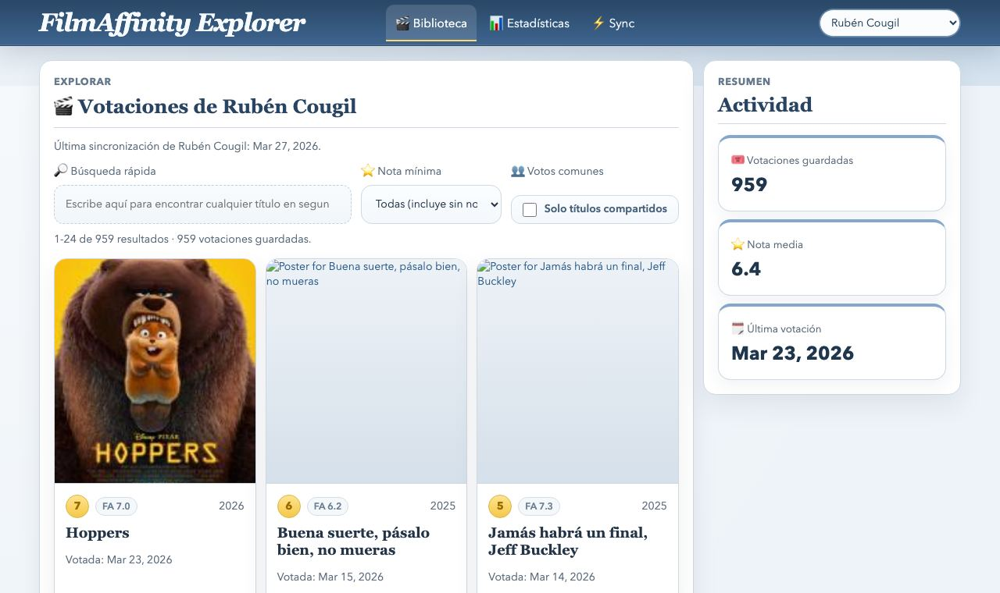

# 🎬 Filmaffinity Explorer

A local web app to browse, sync, and analyze FilmAffinity ratings for one or more users.



## ✨ What you can do

- Browse the selected user library with fast search and filters
- Compare shared titles and votes across configured users
- Open a dedicated Sync page with live progress + logs
- Explore a full Stats page with charts and agreement analytics
- Keep data cached locally for quick startup

## 🚀 Quick start

```bash
npm install
cp config.example.json config.json
npm start
```

Open: `http://127.0.0.1:3000`

## ⚙️ Configure users

Edit local `config.json` (created from `config.example.json`):

```json
{
  "filmaffinity": {
    "defaultUser": "Usuario Principal",
    "users": [
      { "name": "Usuario Principal", "userId": "123456" },
      { "name": "Usuario Secundario", "userId": "654321" }
    ]
  }
}
```

## 🔄 How sync works

1. The server loads cached libraries from `data/libraries` on startup.
2. Sync runs only when you trigger it from the Sync page.
3. After a successful run, one JSON cache file is updated per user.
4. Next startup reuses cached data instantly.

### 🛡️ Challenge / CAPTCHA fallback

Sync starts in headless Chrome using a persistent Playwright profile.

If FilmAffinity blocks with challenge/CAPTCHA, sync retries automatically in visible Chrome so you can pass verification manually. After verification, scraping continues automatically.

## 🧭 Pages

- `/` → Library explorer
- `/stats.html` → Stats and agreement analytics
- `/sync.html` → Sync controls and live logs

## 🔒 Privacy-friendly by default

This repo is prepared to avoid uploading personal local data:

- `config.json` is ignored
- `data/libraries/*.json` is ignored
- `.playwright/` browser profile/cookies are ignored
- `node_modules/` is ignored

## 📦 Tech stack

- Node.js
- Playwright
- Vanilla HTML/CSS/JS
